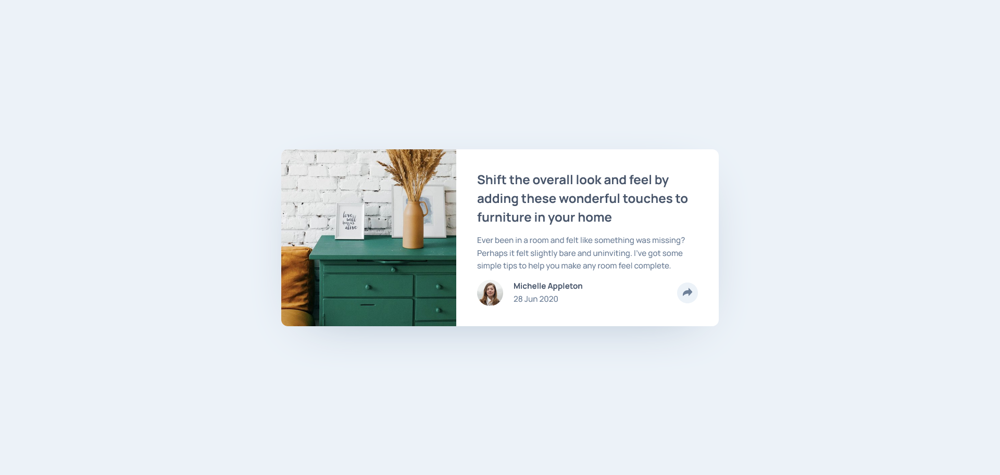

# Frontend Mentor - Article preview component solution

This is a solution to the [Article preview component challenge on Frontend Mentor](https://www.frontendmentor.io/challenges/article-preview-component-dYBN_pYFT).

## Table of contents

- [Overview](#overview)
  - [The challenge](#the-challenge)
  - [Screenshot](#screenshot)
  - [Links](#links)
- [Built With](#built-with)

## Overview

### The challenge

The challenge was that the users should be able to:

- View the optimal layout for the component depending on their device's screen size
- See the social media share links when they click the share icon

### Screenshot

### Links

- Solution URL: [Source code on GitHub](https://github.com/yashgo09/article-preview-component)
- Live Site URL: [Live on GitHub pages](https://yashgo09.github.io/article-preview-component/)

## My process

### Built with

- Semantic HTML5 markup
- CSS custom properties
- Flexbox
